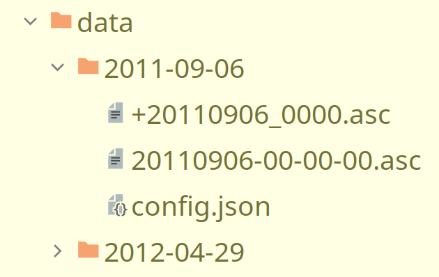

# DrumCorr
[](https://forthebadge.com)
[](https://forthebadge.com)
[](https://forthebadge.com)

[comment]: [](https://pypi.python.org/pypi/obspy/)
[comment]: [](https://www.gnu.org/licenses/lgpl.html)

[](https://www.gnu.org/licenses/lgpl.html)
[](https://github.com/ZiCode0/DrumCorr)


DrumCorr is a Python project for calculating auto and cross correlation based on the Obspy library.

## Installation

Simply clone the repository and run the main file:

```bash
# git clone
git clone https://github.com/ZiCode0/DrumCorr.git
cd DrumCorr
# create python virtual environment
python -m venv .venv
# enter venv, linux:
source .venv/bin/activate  # windows: .venv\\Scripts\\activate.bat
# install dependencies
pip install -r requirements.txt
# run script
python main.py
```


## Usage
1. Enter virtual environment:
```bash 
source .venv/bin/activate
```
2. Prepare data folder as in example. Place data files with template, marked with `+` in file name.

3. Place and edit configuration Json file in this one.
Example can be found here: [example/config.json](example/config.json).
4. Specify the config file when running program.
```bash
python main.py -c data/2011-09-06/config.json
```


## Contributing
Pull requests are welcome. For major changes, please open an issue first to discuss what you would like to change.